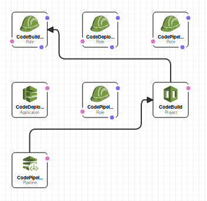
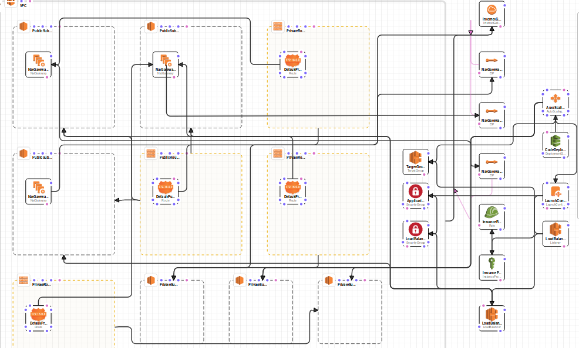

## Build the app
```
go build main.go
```
## Run the app
```
./main
```

or 

```
go run main.go
```

# Setup the AWS CI/CD Pipeline
1. Create an S3 Bucket to house the build artifact.
2. Upload the `pipeline.yml` file into your Cloudformation S3 Bucket.
3. Create a new Cloudformation stack from the pipeline.yml and fill out the variables on the front page.
4. #winnerwinnerchickendinner, If all has gone well this will deploy the CI/CD resources required and automaticly run the first build of the pipeline and deploy the staging environemnt.

# Explinations
The `pipeline.yml` sets up all of the resources required for the code build/deploy pipeline and is not required to live in your main code repo as it is not used once the pipeline is setup, In this setup the `infrastructure.yml` lives in the `cloudformation/` directory in repo as it is a build artifact produced at build time and then it is used in conjunction with the environment config in the `config` directory.

Apologies for the poor screenshots my equipment is limited at the moment.

`Pipeline.yml` Stack Map



`infrastrucure.yml` Stack Map



# Notes

* It looks like AWS does not support port redirect in CF yet and i could not find a way of doing this without haveing lambda or nginx proxy port 80 to 443.
* You will have to manually pre-link your github account to codebuild in the AWS Console buy creating a new codebuild project and going throught the OAUTH account linking steps for github, You can then cancel the project creation as it is not required as the CF will create it.
* Deploying to Prod will require an account that has the EIP allocation limit raised passed the default of 5 due to the NAT Gateway Allocations.